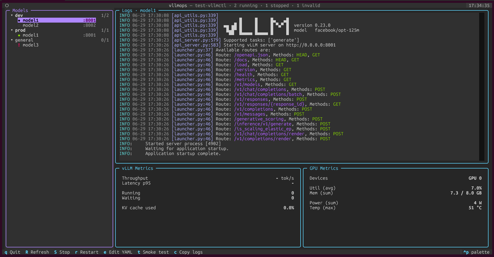

<h1 align="center">vllmctl</h1>

<p align="center">
  <em>A tiny control plane for bare-metal <a href="https://github.com/vllm-project/vllm">vLLM</a> servers.</em>
</p>

<p align="center">
  <a href="https://github.com/Freim32/vllmctl/actions"></a>
  <a href="https://www.python.org/downloads/"></a>
  <a href="LICENSE"></a>
  <a href="https://github.com/astral-sh/ruff"></a>
  <a href="https://mypy-lang.org/"></a>
</p>

<p align="center">
  
</p>

---

## Overview

`vllmctl` declares vLLM models as YAML and runs them as plain detached processes. It ships a Textual TUI that scrapes each model's `/metrics` endpoint directly into an in-memory ring buffer, so you get live throughput, latency, KV cache and GPU stats without Docker, Prometheus or Grafana.

- **One YAML per model.** Version-controlled with the rest of your project.
- **Predictable lifecycle.** `start`, `stop`, `restart`, `status`, `health`, `logs`.
- **Profile groups.** Group models, run lifecycle on all of them in parallel (Docker-Desktop style).
- **Live metrics, no stack.** Direct `/metrics` scrape, ~30 min history per model.
- **Per-project venv.** Activates the project's `.venv` automatically, no global `vllm` required.
- **POSIX, type-checked, tested.** Linux/macOS, mypy strict, 180+ tests.

## Install

Requires Python 3.10+ on Linux or macOS.

```bash
pipx install git+https://github.com/Freim32/vllmctl
```

Or with `uv`:

```bash
uv tool install git+https://github.com/Freim32/vllmctl
```

## Quickstart

```bash
mkdir my-llms && cd my-llms
vllmctl init
uv sync                    # creates .venv with vLLM installed
vllmctl create-model       # interactive: name, HF model, GPUs, port
vllmctl start qwen3        # blocks on /health by default
vllmctl tui                # live metrics
```

Layout after `init`:

```
my-llms/
├── .vllmctl/config.yaml     # project config
├── configs/models/*.yaml    # one file per model
├── runtime/logs/            # rotated per spawn (.log + .log.prev)
├── runtime/pids/
├── pyproject.toml           # vLLM as a dep, installed via uv sync
└── .env.example
```

## Model YAML

```yaml
name: qwen3
metrics_port: 8001
env:
  CUDA_VISIBLE_DEVICES: "0"
  HF_TOKEN: ${HF_TOKEN}
vllm:
  model: Qwen/Qwen3-8B
  args:
    --port: 8001
    --max-model-len: 8192
  flags:
    - --disable-access-log-for-endpoints
    - /health,/metrics,/ping
```

`env` supports `${VAR}` interpolation from the shell, `.env`, and the project config (shell wins).

## Profiles

Group models for bulk lifecycle. Declare in `.vllmctl/config.yaml`:

```yaml
profiles:
  dev: [qwen3, llama-small]
  prod: [qwen3-prod]
```

Then run lifecycle commands on the whole group. Each member is processed in parallel; already-running members are skipped (idempotent), broken YAMLs don't block the rest, failures are reported per-model:

```bash
vllmctl start --profile dev      # parallel spawn + parallel /health wait
vllmctl stop --profile dev
vllmctl restart --profile dev
vllmctl profile list             # all profiles with running/total counts
vllmctl profile show dev         # members and their state
```

Models not declared in any profile fall into the synthetic `general` group. The TUI sidebar renders the same grouping; selecting a profile node makes `s`/`S`/`r` operate on every member.

## Commands

| Command | Description |
| --- | --- |
| `vllmctl init [PATH]` | Initialize a project workspace |
| `vllmctl create-model` | Scaffold a model YAML |
| `vllmctl validate` | Validate all model YAMLs |
| `vllmctl start <name> \| --profile <p>` | Spawn one model or every model in a profile |
| `vllmctl stop <name> \| --profile <p>` | SIGTERM, then SIGKILL after timeout |
| `vllmctl restart <name> \| --profile <p>` | Stop, then start |
| `vllmctl status [<name>]` | Running / stale / stopped |
| `vllmctl health <name>` | One-shot `/health` probe |
| `vllmctl logs <name> [--tail N] [-f]` | Print or follow a model log |
| `vllmctl command <name>` | Print the underlying vLLM command |
| `vllmctl profile list \| show <p>` | Inspect profiles defined in config |
| `vllmctl tui` | Launch the Textual TUI |

Run `vllmctl <command> --help` for full options.

## Development

```bash
git clone https://github.com/Freim32/vllmctl
cd vllmctl
uv sync
uv run pytest
uv run mypy
uv run ruff check src tests
```

## License

[Apache-2.0](LICENSE)
