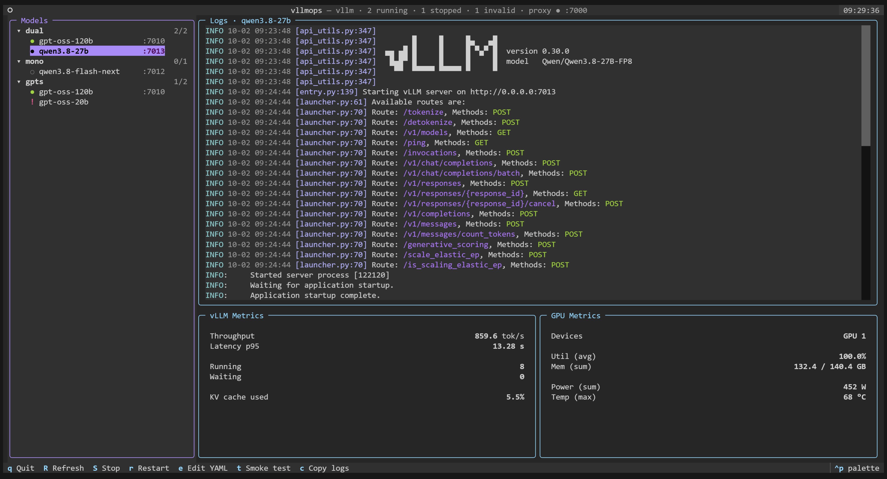

<h1 align="center">vllmops</h1>

<p align="center">
  <em>A tiny control plane for bare-metal <a href="https://github.com/vllm-project/vllm">vLLM</a> servers.</em>
</p>

<p align="center">
  <a href="https://github.com/Freim32/vllmops/actions"></a>
  <a href="https://pypi.org/project/vllmops/"></a>
  <a href="https://www.python.org/downloads/"></a>
  <a href="LICENSE"></a>
  <a href="https://github.com/astral-sh/ruff"></a>
  <a href="https://mypy-lang.org/"></a>
</p>

<p align="center">
  
  <br>
  <sub>Live metrics and logs per model, one gateway, a broken YAML that blocks nothing.</sub>
</p>

---

## Overview

Self-hosted vLLM made simple. Declare each model in its own YAML file, group models into profiles in your project config, then drive their full lifecycle from either the CLI or a live TUI.

- **Git-friendly YAML.** One file per model, profiles in `.vllmops/config.yaml`. Reviewed in pull requests, reproducible on a fresh machine.
- **Full lifecycle.** `start`, `stop`, `restart`, `status`, `health`, `logs`. Single model or whole profile, in parallel.
- **CLI and TUI, same actions.** Run from the terminal in scripts, or open the TUI for a live view.
- **One gateway.** `vllmops proxy start` generates a LiteLLM config from your catalog: every model behind a single OpenAI-compatible URL, kept in sync as you start and stop models.
- **Live metrics, no stack.** Direct `/metrics` scrape, in-memory ring buffer. No Docker, no Prometheus, no Grafana.
- **Per-project venv.** Each workspace pins its own vLLM via `uv`. No global install required.
- **POSIX, type-checked, tested.** Linux/macOS, mypy strict, 380+ tests.

## Contents

- [Install](#install)
- [Quickstart](#quickstart)
- [Model YAML](#model-yaml)
- [Profiles](#profiles)
- [LiteLLM proxy](#litellm-proxy)
- [Commands](#commands)
- [Shell completion](#shell-completion)
- [Contributing](#contributing)
- [License](#license)

## Install

Requires Python 3.10+ on Linux or macOS.

```bash
pipx install vllmops
```

Or with `uv`:

```bash
uv tool install vllmops
```

### Nightly builds

A [nightly release](https://github.com/Freim32/vllmops/releases/tag/nightly) is built from `main` on
demand and carries a dev version like `0.5.0.dev202609091420`. It is meant for trying unreleased
changes on a real machine, not for anything you depend on. One command, because it reads the wheel
URL off the release page:

```bash
uv tool install --force "$(curl -sL \
  https://api.github.com/repos/Freim32/vllmops/releases/tags/nightly \
  | grep -o 'https://[^"]*\.whl')"
vllmops --version
```

Going back to the last release is `uv tool install --force vllmops`.

## Quickstart

```bash
mkdir my-llms && cd my-llms
vllmops init
uv sync                    # creates .venv with vLLM installed
vllmops create-model       # interactive: name, HF model, GPUs, port
vllmops start qwen3        # blocks on /health by default
vllmops tui                # live metrics
```

Layout after `init`:

```
my-llms/
├── .vllmops/config.yaml     # project config
├── configs/models/*.yaml    # one file per model
├── runtime/logs/            # rotated per spawn (.log + .log.prev)
├── runtime/pids/
├── pyproject.toml           # vLLM as a dep, installed via uv sync
└── .env.example
```

## Model YAML

`vllmops create-model --name qwen3 --model Qwen/Qwen3-8B --gpus 0 --port 8001` writes:

```yaml
name: qwen3
env:
  CUDA_VISIBLE_DEVICES: '0'
  HF_HOME: data/huggingface
  VLLM_LOGGING_LEVEL: INFO
vllm:
  executable: vllm
  subcommand: serve
  model: Qwen/Qwen3-8B
  args:
    --host: 0.0.0.0
    --port: 8001
    --tensor-parallel-size: 1
    --dtype: auto
    --served-model-name: qwen3
    --disable-access-log-for-endpoints: /health,/metrics,/ping
  flags: []
  extra_args: []
metrics:
  path: /metrics
```

`env` supports `${VAR}` interpolation from the shell, `.env`, and the project config (shell wins). Add `HF_TOKEN: ${HF_TOKEN}` for gated models.

## Profiles

Group models for bulk lifecycle. Declare in `.vllmops/config.yaml`:

```yaml
profiles:
  dev: [qwen3, llama-small]
  prod: [qwen3-prod]
```

Then run lifecycle commands on the whole group. Each member is processed in parallel; already-running members are skipped (idempotent), broken YAMLs don't block the rest, failures are reported per-model:

```bash
vllmops start --profile dev      # parallel spawn + parallel /health wait
vllmops stop --profile dev
vllmops restart --profile dev
vllmops profile list             # all profiles with running/total counts
vllmops profile show dev         # members and their state
```

Models not declared in any profile fall into the synthetic `general` group. The TUI sidebar renders the same grouping; selecting a profile node makes `s`/`S`/`r` operate on every member.

## LiteLLM proxy

Every model is its own server on its own port. `vllmops proxy` puts one [LiteLLM](https://github.com/BerriAI/litellm) gateway in front of all of them, so clients keep a single base URL and pick the model by name:

```bash
uv tool install 'litellm[proxy]'   # once per machine, outside the project
vllmops proxy start                # writes runtime/litellm.yaml, then serves it
vllmops proxy status
```

Install litellm as its own tool, not into the project: `litellm[proxy]` pins its own versions of `openai`, `rich` and other packages, and sharing a venv with vLLM can downgrade vLLM's.

```bash
curl http://127.0.0.1:4000/v1/chat/completions \
  -H 'Content-Type: application/json' \
  -d '{"model": "qwen3", "messages": [{"role": "user", "content": "ciao"}]}'
```

The config is generated from the catalog: every running model becomes one entry, keyed by its vllmops name and routed to its own `--served-model-name` upstream.

```yaml
model_list:
- model_name: qwen3
  litellm_params:
    model: hosted_vllm/qwen3
    api_base: http://127.0.0.1:8001/v1
```

`vllmops proxy config` prints that YAML so you can review it before starting the gateway.

The gateway is a singleton per project, and its whole shape lives in `.vllmops/config.yaml`:

```yaml
proxy:
  host: 127.0.0.1          # gateway bind address
  port: 4000
  upstream_host: 127.0.0.1 # host used in each api_base
  executable: litellm
  profile: null            # null routes the whole catalog
  expose: running          # running | all (all also routes stopped models)
  num_workers: 1
  detailed_debug: false
```

Edit a value there and run `vllmops proxy restart` to apply it. That file is the single source of the gateway's shape, so a gateway that regenerates itself always comes back exactly as you started it. The new config is checked before the running gateway is stopped: a restart that cannot start, say an empty profile or a port taken by a model, fails and leaves the running gateway in place.

### Following the models

While the gateway is up it follows the catalog. Every `start`, `stop` and `restart`, single or by profile, from the CLI or the TUI, regenerates the config and respawns the gateway when the result differs from what is on disk. A file-based LiteLLM config is read at startup, so this is a respawn: requests in flight during the swap are dropped, and the gateway is down for a second or two. The command reports `proxy refreshed` only once the new gateway answers, or says in yellow that it did not.

You own the gateway's lifetime: `vllmops proxy start` brings it up and `vllmops proxy stop` takes it down.

A model that dies on its own keeps its entry in `model_list`, so calling it returns an error. `vllmops proxy status` and the TUI header report the config as out of date, and `vllmops proxy restart` brings it back in line.

When the last model stops, the gateway stays up on the config it already has and prints a yellow line saying so, so the endpoint keeps answering while you start the next model.

The TUI header shows the gateway state: `proxy ● :4000` up, `proxy ▴ :4000` up with a config out of date, `proxy ◌` down.

`vllmops proxy logs` reads one log across respawns: each start is marked by a `=== vllmops: process started <time> ===` line, and the file moves to `_proxy.log.prev` once it passes 50 MB.

To supervise the gateway, point a systemd unit at the vllmops commands rather than at `litellm` (`Type=oneshot`, `RemainAfterExit=yes`, `ExecStart=vllmops proxy start`, `ExecStop=vllmops proxy stop`). vllmops spawns the process detached and owns its pid file, so let those two commands drive it: a `litellm` killed from outside leaves the pid file behind, which `vllmops proxy status` reports as stale and the next `vllmops proxy start` clears.

For anything else LiteLLM accepts, write `.vllmops/litellm.yaml`. Its blocks are merged into the generated config, and `model_list` entries are appended, so you can mix a remote endpoint into the same gateway:

```yaml
litellm_settings:
  drop_params: true
  num_retries: 2
model_list:
- model_name: gpt-4o
  litellm_params:
    model: openai/gpt-4o
    api_key: os.environ/OPENAI_API_KEY
```

`vllmops proxy start` and `restart` list those entries after the catalog models, marked `(overlay)`.

Set `LITELLM_MASTER_KEY` in your shell or `.env` to require a key on the gateway. It is written as `os.environ/LITELLM_MASTER_KEY`, never as a literal, so the generated config holds no secrets.

## Commands

| Command | Description |
| --- | --- |
| `vllmops init [PATH]` | Initialize a project workspace |
| `vllmops create-model` | Scaffold a model YAML |
| `vllmops validate` | Validate all model YAMLs |
| `vllmops start <name> \| --profile <p>` | Spawn one model or every model in a profile |
| `vllmops stop <name> \| --profile <p>` | SIGTERM, then SIGKILL after timeout |
| `vllmops restart <name> \| --profile <p>` | Stop, then start |
| `vllmops status [<name>]` | Running / stale / stopped |
| `vllmops health <name>` | One-shot `/health` probe |
| `vllmops logs <name> [--tail N] [-f]` | Print or follow a model log |
| `vllmops command <name>` | Print the underlying vLLM command |
| `vllmops profile list \| show <p>` | Inspect profiles defined in config |
| `vllmops proxy start \| stop \| restart` | Run one LiteLLM gateway in front of the models |
| `vllmops proxy status \| config` | Gateway state and drift, or print the generated config |
| `vllmops proxy logs [--tail N] [-f]` | Print or follow the gateway log |
| `vllmops tui` | Launch the Textual TUI |
| `vllmops doctor` | Diagnose local setup (Python, venv, vllm, GPUs, ports, ...) |
| `vllmops completion <shell>` | Print shell completion script (bash, zsh, fish, powershell) |

Run `vllmops <command> --help` for full options.

## Shell completion

```bash
# bash
vllmops completion bash > ~/.local/share/bash-completion/completions/vllmops

# zsh (ensure `fpath+=~/.zfunc` and `autoload -U compinit && compinit` are in your .zshrc)
vllmops completion zsh > ~/.zfunc/_vllmops

# fish
vllmops completion fish > ~/.config/fish/completions/vllmops.fish
```

Restart your shell. Alternative: `vllmops --install-completion` auto-detects the current shell and installs in one step.

## Contributing

Contributions of any size are welcome. See [CONTRIBUTING.md](CONTRIBUTING.md) for local setup and the project checks.

## License

[Apache-2.0](LICENSE)
